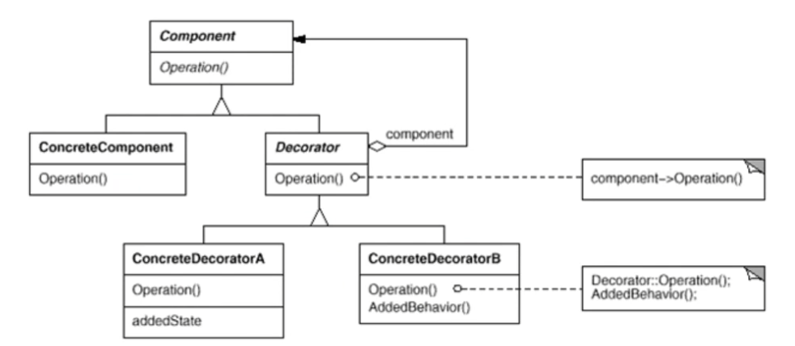

# 데코레이터 패턴을 활용한 커피 머신 프로그램

## Decorator Pattern

- 자바의 입출력 스트림은 decorator pattern임.
- 여러 decorator들을 활용하여 다양한 기능을 제고
- 상속보다 유연한 구현 방식
- 데코레이터는 다른 데코레이터나 또는 컴포넌트를 포함해야 함.
- 지속적인 기능의 추가와 제거가 용이함
- decorator와 component는 동일한 것이 아님 (기반 스트림 클래스가 직접 읽고 쓸 수 있음, 보조 스트림은 추가적인 기능 제공)
- 클래스다이어그램

## 커피를 만들어 보아요~

> Decorator Pattern을 활용하여 커피를 만들어 봅시다.

아메리카노
카페 라떼 = 아메리카노 + 우유
모카 라떼 = 아메리카노 + 우유 + 모카시럽
휘핑 크림이 올라간 모카 라떼 = 아메리카노 + 우유 + 모카시럽 + whipping cream

커피는 컴포넌트이고 우유, 모카시럽, whipping cream은 모두 데코레이터임.
>